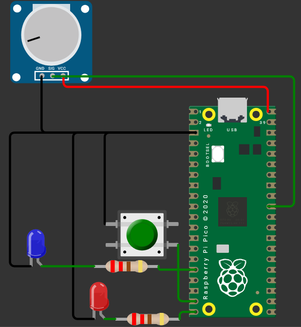

# Introduction to Micropython Pi Pico

  

This repository contains simple example codes and explanations for beginners to get started with MicroPython on the Raspberry Pi Pico. The project demonstrates basic functionalities such as:

- Digital input and output (using buttons and LEDs)
- Analog input reading (using ADC for potentiometer)
- PWM control (for LED brightness or analog actuators)
- Basic software debounce techniques for buttons

## Features

- Read analog values from a potentiometer using ADC
- Control LED brightness using PWM based on analog input
- Detect button presses with internal pull-up resistor
- Simple debounce implementation to stabilize button input
- Serial output of sensor readings for debugging and monitoring

## Hardware Requirements

- Raspberry Pi Pico or compatible RP2040 board
- LED and resistor
- Push button (normally open)
- Potentiometer (variable resistor)
- Breadboard and jumper wires

## Wiring Overview

| Component    | Raspberry Pi Pico Pin | Notes                        |
|--------------|----------------------|------------------------------|
| LED          | GP15                 | Digital output with resistor |
| PWM LED      | GP12                 | PWM output                   |
| Push Button  | GP14                 | Input with internal pull-up  |
| Potentiometer| GP26 (ADC0)          | Analog input                 |

## Usage

1. Open [Wokwi](https://wokwi.com/).
2. Upload the Python scripts `main.py`.
4. Run the script.
